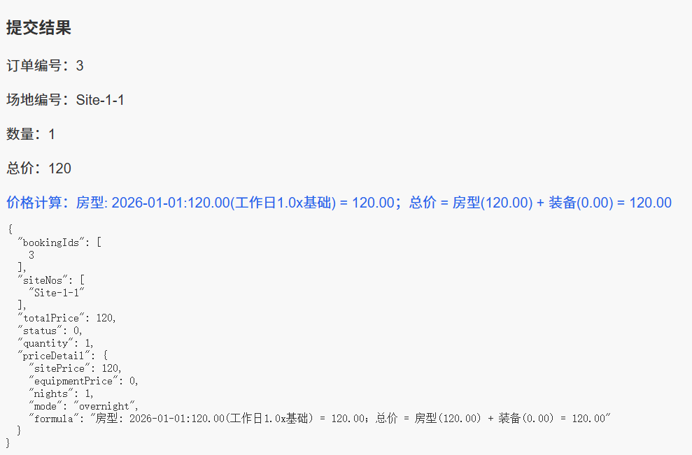
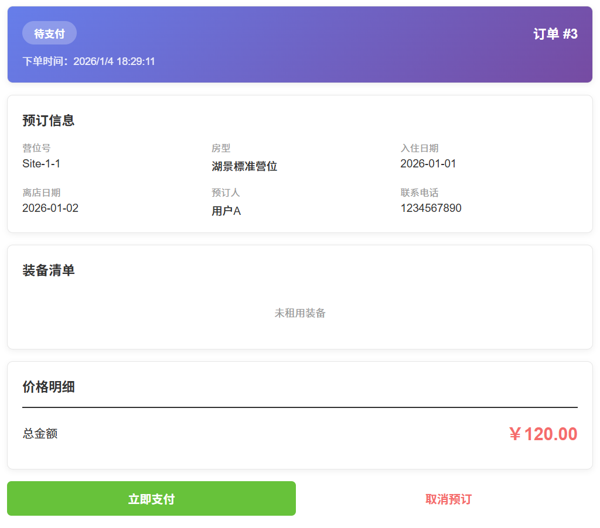
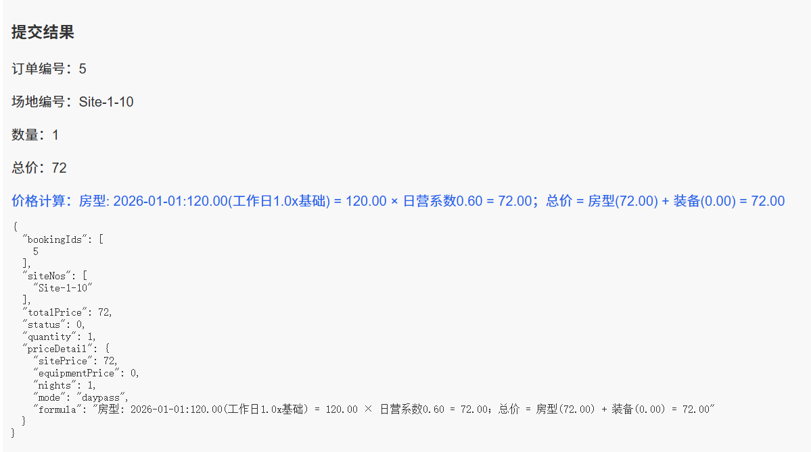
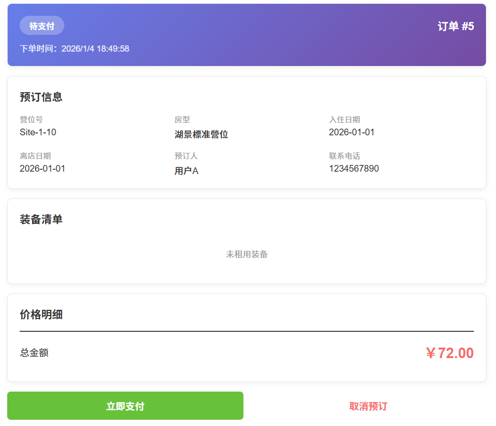
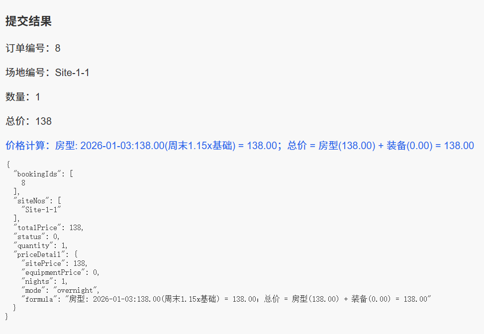
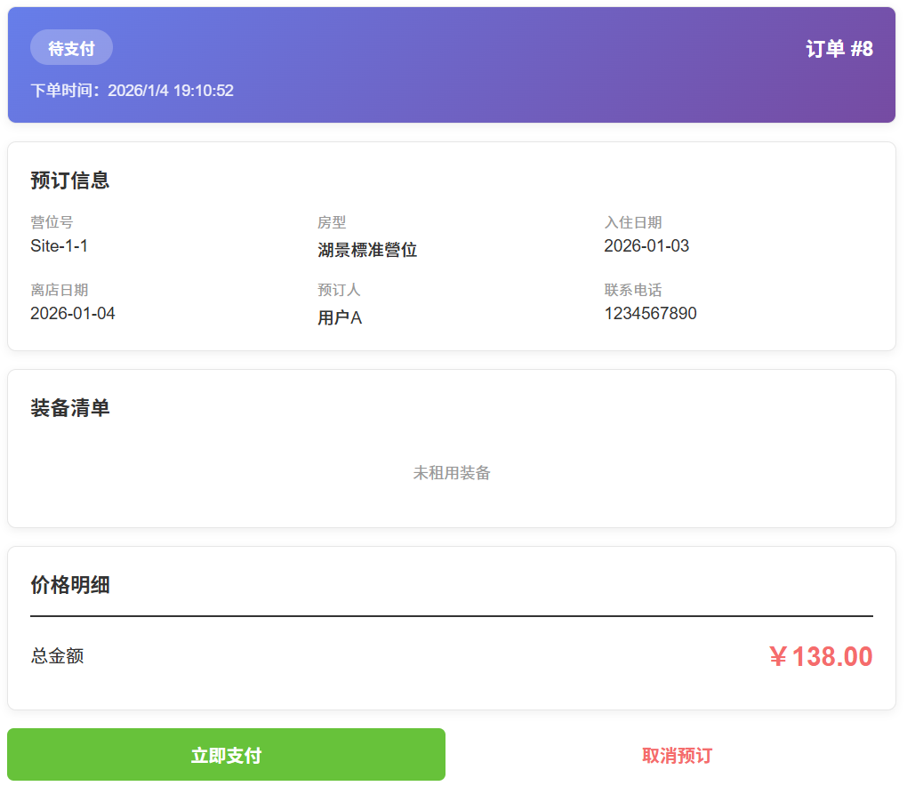
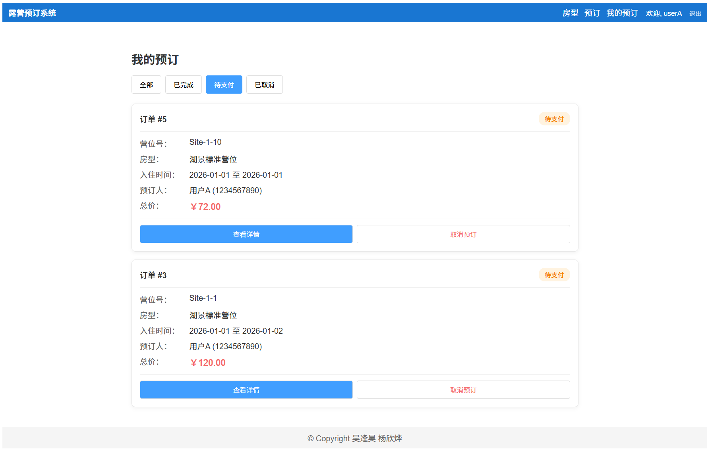

# 数据库系统实验课程设计报告

**项目名称**：露营营地/特色民宿预订管理系统
**仓库地址**：https://github.com/Prof-yxy/Accommodation_Booking_System
**学 院**：计算机学院
**专 业**：计算机科学与技术
**姓名/学号**： 杨欣烨 23336283、吴逢昊 23336248
**指导教师**：潘嵘
**实验日期**：2026 年 1 月

## 1. 引言

### 1.1 项目背景与意义

近年来，“精致露营”（Glamping）作为一种新兴的非标住宿业态迅速崛起。与传统酒店标准化的客房不同，露营地涉及草地、木平台、房车位、固定帐篷等多种形态的住宿单元。此外，露营业务还包含“日营（Day Pass）”与“过夜（Overnight）”两种截然不同的计费模式，以及帐篷、烧烤架等装备的租赁管理。现有的通用酒店管理系统（PMS）难以满足这种多业态、强库存耦合（住宿+装备）的管理需求。因此，开发一套专用的露营营地预订管理系统具有极高的实用价值。

### 1.2 设计目的

本课程设计旨在综合运用《数据库系统原理》课程知识，设计并实现一个完整的非标住宿预订平台。主要目的包括：

1. **掌握数据库全流程设计**：从需求分析到概念设计、逻辑设计及物理实施。
2. **解决复杂业务逻辑**：通过数据库约束和事务处理，解决营位冲突检测、装备库存联动扣减等高并发问题。
3. **全栈开发实践**：基于 Spring Boot 和 Vue3 实现前后端分离架构，并使用 PostgreSQL 进行数据持久化。

### 1.3 技术选型与开发环境

本项目基于 GitHub 仓库 `Accommodation_Booking_System` 进行开发与完善。

- **后端**：Java Spring Boot (Web, MyBatis-Plus/JPA)
- **前端**：Vue 3 + Vite + TypeScript + Pinia
- **数据库**：PostgreSQL 14+
- **开发工具**：IntelliJ IDEA, VS Code, Navicat
- **部署环境**：Windows 11 (PowerShell 脚本自动化部署)

### 1.4 团队分工

- 吴逢昊：SQL 脚本编写（Schema, Views, Triggers）以及后端 BookingService 核心逻辑实现。
- 杨欣烨：负责数据库 E-R 建模、前端 Vue 页面开发、API 接口对接及系统测试。

---

## 2. 系统需求分析

### 2.1 业务流程分析

系统核心业务围绕“预订”展开。

1. **资源浏览**：用户进入系统，浏览不同类型的营位（草地/平台/房车）。
2. **下单流程**：
   1. 用户选择日期，系统根据是“工作日”还是“周末”自动匹配价格日历
   2. 用户根据选择入住和离开日期选择“过夜”或“日营”模式，入住和离开为同一天则为"日营"，租用时间超过一天则为"过夜"
   3. 可选填租赁装备（如冰箱、炊具等）
3. **库存校验**：系统需同时校验营位的时间段空闲状态，以及装备在对应时间段的剩余库存。
4. **支付与确认**：支付成功后，系统生成订单，扣减相应库存，并发送确认通知。

### 2.2 数据流图 (DFD)

- **Level-0**：用户 -> [预订请求] -> **预订处理系统** -> [订单详情] -> 用户。
- **Level-1**：
  - 用户提交查询 -> **P1 资源查询模块** (读取 Campsite/Equipment 表) -> 返回可用列表。
  - 用户提交订单 -> **P2 订单校验模块** (读取 PriceCalendar/Inventory) -> **P3 订单生成模块** (写入 Booking 表, 更新 Stock)。


### 2.3 功能需求详解

1. **营位管理**：支持增删改查营位信息，包括图片 URL、容纳人数、基础设施描述。
2. **灵活计费**：
   - 支持**双重计费策略**（优先级：数据库定价 > 默认策略）：
     - **特定日期定价（优先）**：管理员可针对特定日期（如节假日、旺季）单独设置价格。系统初始化数据中，周五/周六设为 1.2 倍，周日设为 1.1 倍。
     - **默认周末策略（兜底）**：若未配置特定日期价格，系统自动应用默认逻辑：
       - 周末（周六、日）：基础价 \* 1.15
       - 工作日：基础价 \* 1.0
   - 支持**分时计费**：日营与过夜定价不同
     - 日营价格 = 当日基础价 \* 0.6
     - 过夜价格 = 当日基础价 \* 1.0
   - 价格计算逻辑
     - 首先根据当日是否为周末确定当日基础价
     - 再根据预订时间是日营还是过夜计算总价
3. **装备租赁与库存联动**：装备（Equipment）不绑定特定房间，属于全局库存。预订营位时可“加购”装备，系统需保证装备不超售。
4. **订单管理**：支持订单状态流转（待支付 -> 已支付 -> 已完成/已取消/已退款）。


### 2.4 非功能需求

- **数据一致性**：必须使用数据库事务（Transaction）确保“营位预订”与“装备扣减”原子性执行。
- **响应速度**：空房查询需在 1 秒内返回。

---

## 3. 数据库设计

### 3.1 概念结构设计 (E-R 图)

系统主要实体包含：`User` (用户), `Campsite` (营位), `SiteType` (营位类型), `Booking` (订单), `Equipment` (装备), `BookingEquipment` (订单装备关联)。


### 3.2 逻辑结构设计 (关系模式)

基于 PostgreSQL 的特性，我们将 E-R 图转换为关系模式，并进行规范化设计（3NF）：

1. **users** (**user_id**, username, password, phone, role, create_time, update_time)
2. **site_types** (**type_id**, type_name, base_price, max_guests, description, image_url, status)
3. **sites** (**site_id**, type_id, site_no, status, create_time, update_time)
   - _FK_: type_id -> site_types(type_id)
4. **equipments** (**equip_id**, equip_name, unit_price, total_stock, category, description, status)
5. **bookings** (**booking_id**, user_id, site_id, type_id, check_in, check_out, guest_name, guest_phone, total_price, status, create_time, update_time)
   - _FK_: user_id -> users(user_id), site_id -> sites(site_id), type_id -> site_types(type_id)
6. **booking_equips** (**booking_equip_id**, booking_id, equip_id, quantity)
   - _FK_: booking_id -> bookings(booking_id), equip_id -> equipments(equip_id)
7. **daily_prices** (**price_id**, type_id, specific_date, price, remark)
   - _FK_: type_id -> site_types(type_id)

### 3.3 物理结构设计 (表结构与索引)

本部分对应仓库中的 `sql/schema_utf8.sql` 文件。

```sql
-- 示例：bookings 表的物理定义 (PostgreSQL)
CREATE TABLE IF NOT EXISTS bookings (
    booking_id BIGSERIAL PRIMARY KEY,
    user_id BIGINT NOT NULL,
    site_id BIGINT NOT NULL,
    type_id BIGINT NOT NULL,
    check_in DATE NOT NULL,
    check_out DATE NOT NULL,
    guest_name VARCHAR(100) NOT NULL,
    guest_phone VARCHAR(20) NOT NULL,
    total_price DECIMAL(10, 2) NOT NULL,
    status INTEGER DEFAULT 0, -- 0: Pending, 1: Confirmed, 2: Cancelled
    create_time TIMESTAMP DEFAULT CURRENT_TIMESTAMP,
    update_time TIMESTAMP DEFAULT CURRENT_TIMESTAMP,
    FOREIGN KEY (user_id) REFERENCES users(user_id),
    FOREIGN KEY (site_id) REFERENCES sites(site_id),
    FOREIGN KEY (type_id) REFERENCES site_types(type_id)
);
```

### 3.4 视图与触发器设计

本部分对应仓库中的 `sql/views_triggers.sql` 文件。这是数据库设计的亮点，利用数据库原生能力保证逻辑严密性。

**1. 视图 (View): 运营数据统计**

```sql
-- 每日营收统计视图
CREATE OR REPLACE VIEW view_daily_revenue AS
SELECT 
    DATE(b.create_time) as revenue_date,
    st.type_id,
    st.type_name,
    COUNT(DISTINCT b.booking_id) as booking_count,
    SUM(CASE WHEN b.status = 1 THEN b.total_price ELSE 0 END) as revenue
FROM bookings b
JOIN site_types st ON b.type_id = st.type_id
GROUP BY DATE(b.create_time), st.type_id, st.type_name
ORDER BY revenue_date DESC;
```

**2. 触发器 (Trigger): 审计日志与状态更新**

```sql
-- 触发器：预订状态变更审计日志
CREATE OR REPLACE FUNCTION log_booking_status_change()
RETURNS TRIGGER AS $$
BEGIN
    IF OLD.status != NEW.status THEN
        INSERT INTO operation_logs (
            operation, operator_id, operator_name, description, details, log_time
        )
        VALUES (
            'update_booking_status',
            NEW.user_id,
            'system',
            'Booking status updated: ID ' || NEW.booking_id || ' from ' || OLD.status || ' to ' || NEW.status,
            JSON_BUILD_OBJECT('old', OLD.status, 'new', NEW.status)::text,
            CURRENT_TIMESTAMP
        );
    END IF;
    RETURN NEW;
END;
$$ LANGUAGE plpgsql;
```

---

## 4. 程序设计与实现

本系统采用典型的 Spring Boot 分层架构。

### 4.1 系统架构与代码映射

仓库结构 (`camping-system/`) 清晰地划分了前后端与数据库脚本：

1. **数据库层**：

   - **代码位置**：`sql/schema_utf8.sql` (表定义), `sql/views_triggers.sql` (触发器/视图)。
   - **作用**：定义数据持久化结构，是整个系统的基石。

2. **后端服务层**：
   - **代码位置**：`backend/src/main/java/com/camping/`
     - `entity/`：存放 MyBatis 实体类，如 `Booking.java`，直接映射数据库表。
     - `controller/`：`BookingController.java`，负责接收前端的 JSON 请求，如 `/api/bookings/create`。
     - `service/impl/`：核心业务逻辑实现。
     - `config/`：存放全局配置类，如 `CorsConfig.java`。
   - **配置文件**：`src/main/resources/application.yml`，配置 PostgreSQL 连接（如 `jdbc:postgresql://localhost:5432/camping_db`）。
   
3. **前端展示层**：
   - **代码位置**：`frontend/src/`
     - `views/`：页面级组件
       - `SiteList.vue`：首页营位展示，支持按类型筛选与状态查看。
       - `BookingConfirm.vue`：核心预订页，实现日期选择、价格日历联动、装备加购及总价实时计算。
       - `MyBookings.vue`：用户订单中心，展示订单状态（待支付/已完成/已取消）及详情。
       - `AdminDashboard.vue`：管理员后台，提供资源管理、价格设置及数据报表可视化。
     - `components/`：公共组件（如 `HeaderBar.vue` 导航栏, `FooterBar.vue` 页脚）。
     - `stores/`：基于 Pinia 的状态管理（如用户信息、全局配置）。
     - `utils/request.ts`：封装 Axios 拦截器，统一处理 JWT Token 注入与全局错误提示。

### 4.2 核心模块实现原理

#### 4.2.1 营位自动分配

在 `BookingServiceImpl.java` 中，我们实现了**自动分配营位**的逻辑，用户无需手动选择具体营位号，系统会根据房型和日期自动匹配可用资源。

- **原理**：
  - 用户选择房型、入住日期和离店日期。
  - 系统查询该时间段内该房型下所有状态为“可用”且未被预订的营位列表。
  - 若可用营位数量满足用户需求，则按顺序自动分配；否则抛出“库存不足”异常。
- **实现**：此逻辑封装在 `createOrder` 方法中，通过 `SiteMapper.selectAvailable` 查询可用营位，并在内存中完成分配，避免了前端直接操作具体营位带来的并发冲突风险。

#### 4.2.2 装备库存联动

这是一个难点。装备是全局库存。

- **代码实现**：在创建订单时，后端接收 `List<EquipSelectDTO>`。
- **逻辑**：
  1. 开启数据库事务 (`@Transactional`)。
  2. 遍历请求中的装备，查询 `booking_equips` 表，统计在目标时间段内该装备的**已占用总量**。
  3. 若 `(总库存 - 已占用量) < 请求数量`，则抛出异常，事务回滚。

### 4.3 数据库连接与事务控制

后端使用 `application.yml` 配置数据库连接池（HikariCP）。

```yaml
datasource:
  url: jdbc:postgresql://localhost:5432/camping_db
  username: postgres
  password: [密码]
  driver-class-name: org.postgresql.Driver
```

在 Service 层的所有写操作（Create, Update, Delete）上，均强制添加了 `@Transactional` 注解，确保预订营位和扣减装备库存要么同时成功，要么同时失败，保证了 ACID 特性。

---

## 5. 系统调试与测试

### 5.1 测试环境与部署

1. 以管理员身份运行 `setup-env-windows.ps1`，检查并安装部署所需环境。
2. 运行 `setup-full-fix.ps1`，配置数据库，并进行后端的构建。
3. 运行 `start.bat`，分别开启前后端服务，前端页面 URL 为 `localhost:5173`。

### 5.2 功能测试用例

|  测试编号  |      测试场景      |                             操作                             |                   预期结果                    | 实际结果 |
| :--------: | :----------------: | :----------------------------------------------------------: | :-------------------------------------------: | :------: |
| **TC01-A** | **正常预订(过夜)** | 用户 A，“湖景標准營位”，2026 年 1 月 1 日入住，2026 年 1 月 2 日退房 |   订单创建成功，价格为当日价，状态为待支付    |   Pass   |
| **TC01-B** | **正常预订(日营)** | 用户 A，“湖景標准營位”，2026 年 1 月 1 日入住，2026 年 1 月 1 日退房 | 订单创建成功，价格为当日价打6折，状态为待支付 |   Pass   |
|  **TC02**  |    **周末预定**    | 用户 A，“湖景標准營位”，2026 年 1 月 3 日入住（周六），2026 年 1 月 4 日退房 | 订单创建成功，价格为基础价*1.15，状态为待支付 |   Pass   |
|  **TC03**  |    **用户隔离**    |                         新创建用户B                          |            用户B“我的订单”页面为空            |   Pass   |

**TC01-A**：



**TC01-B**：



**TC02**：



**TC03**：




### 5.3 遇到的问题及解决方案

1. **问题**：PostgreSQL 的时间类型处理与 MySQL 不同，导致日期查询报错。
   
   **解决**：在 MyBatis Mapper XML 中，将日期比较函数统一改为标准 SQL 或 PostgreSQL 专用函数（如 `OVERLAPS`）。
2. **问题**：前端 `BookingConfirm.vue` 在计算总价时，未实时响应装备数量的变化。
   
   **解决**：在 Vue 中使用 `computed` 属性监听装备列表的变化，实时重算总价，而不是依赖点击按钮触发。

---

## 6. 总结

通过本次课程设计，我们成功实现了一个功能完备的“露营营地/特色民宿预订系统”。项目不仅覆盖了基础的 CRUD 操作，还深入解决了非标住宿场景下的复杂库存与计费逻辑。

- **工作量体现**：完成了约 10 张数据表的设计，编写了超过 20 个 API 接口，并实现了复杂的 SQL 触发器逻辑。
- **代码规范**：项目结构遵循标准的 Controller-Service-Dao 分层，具有良好的可维护性。

**改进方向**：

1. 引入 Redis 缓存热点营位的空闲状态，降低数据库查询压力。
2. 增加更多样化可视化报表，为营地管理员提供更直观的营收分析。
3. 完善移动端适配，方便用户在手机端进行预订。
