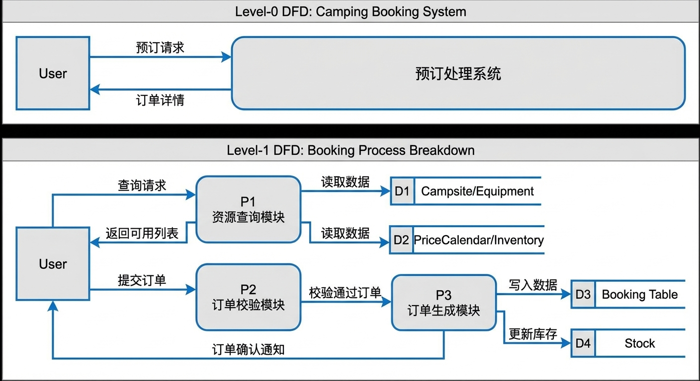
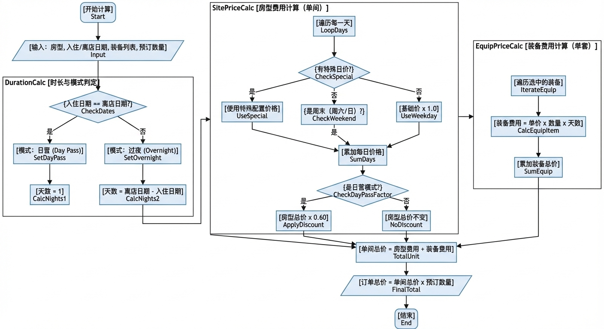
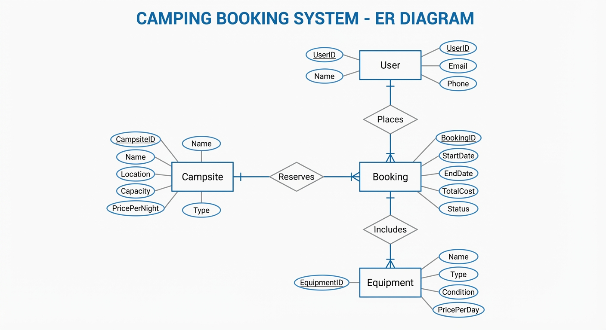

# 数据库系统实验课程设计报告

**项目名称**：露营营地/特色民宿预订管理系统
**仓库地址**：https://github.com/Prof-yxy/Accommodation_Booking_System
**学 院**：计算机学院
**专 业**：计算机科学与技术
**姓名/学号**： 杨欣烨 23336283、吴逢昊 23336248
**指导教师**：潘嵘
**实验日期**：2026 年 1 月

## 1. 引言

### 1.1 项目背景与意义

近年来，“精致露营”（Glamping）作为一种新兴的非标住宿业态迅速崛起。与传统酒店标准化的客房不同，露营地涉及草地、木平台、房车位、固定帐篷等多种形态的住宿单元。此外，露营业务还包含“日营（Day Pass）”与“过夜（Overnight）”两种截然不同的计费模式，以及帐篷、烧烤架等装备的租赁管理。现有的通用酒店管理系统（PMS）难以满足这种多业态、强库存耦合（住宿+装备）的管理需求。因此，开发一套专用的露营营地预订管理系统具有极高的实用价值。

### 1.2 设计目的

本课程设计旨在综合运用《数据库系统原理》课程知识，设计并实现一个完整的非标住宿预订平台。主要目的包括：

1. **掌握数据库全流程设计**：从需求分析到概念设计、逻辑设计及物理实施。
2. **解决复杂业务逻辑**：通过数据库约束和事务处理，解决营位冲突检测、装备库存联动扣减等高并发问题。
3. **全栈开发实践**：基于 Spring Boot 和 Vue3 实现前后端分离架构，并使用 PostgreSQL 进行数据持久化。

### 1.3 技术选型与开发环境

本项目基于 GitHub 仓库 `Accommodation_Booking_System` 进行开发与完善。

- **后端**：Java Spring Boot (Web, MyBatis-Plus/JPA)
- **前端**：Vue 3 + Vite + TypeScript + Pinia
- **数据库**：PostgreSQL 14+
- **开发工具**：IntelliJ IDEA, VS Code, Navicat
- **部署环境**：Windows 11 (PowerShell 脚本自动化部署)

### 1.4 团队分工

- 吴逢昊：SQL 脚本编写（Schema, Views, Triggers）以及后端 BookingService 核心逻辑实现。
- 杨欣烨：负责数据库 E-R 建模、前端 Vue 页面开发、API 接口对接及系统测试。

---

## 2. 系统需求分析

### 2.1 业务流程分析

系统核心业务围绕“预订”展开。

1. **资源浏览**：用户进入系统，浏览不同类型的营位（草地/平台/房车）。
2. **下单流程**：
   1. 用户选择日期，系统根据是“工作日”还是“周末”自动匹配价格日历
   2. 用户根据选择入住和离开日期选择“过夜”或“日营”模式，入住和离开为同一天则为"日营"，租用时间超过一天则为"过夜"
   3. 可选填租赁装备（如冰箱、炊具等）
3. **库存校验**：系统需同时校验营位的时间段空闲状态，以及装备在对应时间段的剩余库存。
4. **支付与确认**：支付成功后，系统生成订单，扣减相应库存，并发送确认通知。

### 2.2 数据流图 (DFD)

- **Level-0**：用户 -> [预订请求] -> **预订处理系统** -> [订单详情] -> 用户。
- **Level-1**：
  - 用户提交查询 -> **P1 资源查询模块** (读取 Campsite/Equipment 表) -> 返回可用列表。
  - 用户提交订单 -> **P2 订单校验模块** (读取 PriceCalendar/Inventory) -> **P3 订单生成模块** (写入 Booking 表, 更新 Stock)。



### 2.3 功能需求详解

1. **营位管理**：支持增删改查营位信息，包括图片 URL、容纳人数、基础设施描述。
2. **灵活计费**：
   - 支持**价格日历**：针对周末设置特定价格倍率
     - 工作日：当日基础价 = 基础价
     - 周末：当日基础价 = 基础价 \* 1.3
   - 支持**分时计费**：日营与过夜定价不同
     - 日营价格 = 当日基础价 \* 0.6
     - 过夜价格 = 当日基础价 \* 1.0
   - 价格计算逻辑
     - 首先根据当日是否为周末确定当日基础价
     - 再根据预订时间是日营还是过夜计算总价
3. **装备租赁与库存联动**：装备（Equipment）不绑定特定房间，属于全局库存。预订营位时可“加购”装备，系统需保证装备不超售。
4. **订单管理**：支持订单状态流转（待支付 -> 已支付 -> 已完成/已取消/已退款）。



### 2.4 非功能需求

- **数据一致性**：必须使用数据库事务（Transaction）确保“营位预订”与“装备扣减”原子性执行。
- **响应速度**：空房查询需在 1 秒内返回。

---

## 3. 数据库设计

### 3.1 概念结构设计 (E-R 图)

系统主要实体包含：`User` (用户), `Campsite` (营位), `SiteType` (营位类型), `Booking` (订单), `Equipment` (装备), `BookingEquipment` (订单装备关联)。



### 3.2 逻辑结构设计 (关系模式)

基于 PostgreSQL 的特性，我们将 E-R 图转换为关系模式，并进行规范化设计（3NF）：

1. **users** (**id**, username, password, role, created_at)
2. **site_types** (**id**, name, description, image_url, base_price_overnight, base_price_daypass)
3. **campsites** (**id**, site_number, type_id, status)
   - _FK_: type_id -> site_types(id)
4. **equipments** (**id**, name, description, total_stock, price)
5. **bookings** (**id**, user_id, site_id, start_time, end_time, type, status, total_amount, created_at)
   - _FK_: user_id -> users(id), site_id -> campsites(id)
6. **booking_equipments** (**id**, booking_id, equipment_id, quantity)
   - _FK_: booking_id -> bookings(id), equipment_id -> equipments(id)

---

### 💡 格式说明：

- **`**id**`**: 表示该字段为主键（原 `<u>` 的含义）。
- **`*FK*`**: 使用斜体表示外键注释，符合文档排版习惯。

### 3.3 物理结构设计 (表结构与索引)

本部分对应仓库中的 `sql/schema.sql` 文件。为了提高查询效率，我们在 `start_time` 和 `end_time` 上建立了索引。

```sql
-- 示例：booking 表的物理定义 (PostgreSQL)
CREATE TABLE bookings (
    id SERIAL PRIMARY KEY,
    user_id INT NOT NULL REFERENCES users(id),
    site_id INT NOT NULL REFERENCES campsites(id),
    start_time TIMESTAMP NOT NULL,
    end_time TIMESTAMP NOT NULL,
    booking_type VARCHAR(20) CHECK (booking_type IN ('DAY_PASS', 'OVERNIGHT')),
    status INT DEFAULT 0, -- 0: Pending, 1: Confirmed, 2: Cancelled
    total_amount DECIMAL(10, 2) NOT NULL,
    created_at TIMESTAMP DEFAULT CURRENT_TIMESTAMP
);

-- 索引设计：用于加速“查找某段时间内已被占用的营位”
CREATE INDEX idx_booking_time_range ON bookings (site_id, start_time, end_time);
CREATE INDEX idx_booking_user ON bookings (user_id);
```

### 3.4 视图与触发器设计

本部分对应仓库中的 `sql/views_triggers.sql` 文件。这是数据库设计的亮点，利用数据库原生能力保证逻辑严密性。

**1. 视图 (View): 实时可用装备库存**

```sql
-- 计算在特定时间段内，某个装备的剩余库存比较复杂，这里可以使用视图简化基础查询
CREATE VIEW v_booking_equipment_summary AS
SELECT be.equipment_id, b.start_time, b.end_time, SUM(be.quantity) as used_count
FROM bookings b
JOIN booking_equipments be ON b.id = be.booking_id
WHERE b.status = 1 -- 仅统计已支付订单
GROUP BY be.equipment_id, b.start_time, b.end_time;
```

**2. 触发器 (Trigger): 自动更新状态**
(假设设计) 当订单插入后，自动检查是否会导致库存变负（虽然应用层也会检查，但数据库层是最后一道防线）。

```sql
-- 触发器函数逻辑伪代码
CREATE OR REPLACE FUNCTION check_stock_before_insert()
RETURNS TRIGGER AS $$
BEGIN
    -- SQL逻辑：检查同一时间段该营位是否已有重叠订单
    IF EXISTS (SELECT 1 FROM bookings WHERE site_id = NEW.site_id AND status != 2
               AND tsrange(start_time, end_time) && tsrange(NEW.start_time, NEW.end_time)) THEN
        RAISE EXCEPTION '该时间段营位已被预订';
    END IF;
    RETURN NEW;
END;
$$ LANGUAGE plpgsql;
```

---

（下面的都是 AI 写的，可以参考一下）

## 4. 程序设计与实现

本系统采用典型的 Spring Boot 分层架构，代码结构清晰，严格遵循 MVC 模式。以下分析基于仓库根目录结构。

### 4.1 系统架构与代码映射

仓库结构 (`camping-system/`) 清晰地划分了前后端与数据库脚本：

1. **数据库层**：

   - **代码位置**：`sql/schema.sql` (表定义), `sql/views_triggers.sql` (触发器/视图)。
   - **作用**：定义数据持久化结构，是整个系统的基石。

2. **后端服务层 (Backend)**：

   - **代码位置**：`backend/src/main/java/com/camping/`
   - `entity/`：存放 JPA/MyBatis 实体类，如 `Booking.java`，直接映射数据库表。
   - `controller/`：`BookingController.java`，负责接收前端的 JSON 请求，如 `/api/bookings/create`。
   - `service/`：`BookingService.java`，**这是核心业务逻辑所在**，处理价格计算、库存校验。
   - `config/`：`application.yml`，配置 PostgreSQL 连接（如 `jdbc:postgresql://localhost:5432/camping_db`）。

3. **前端展示层 (Frontend)**：

   - **代码位置**：`frontend/src/views/`
   - `BookingConfirm.vue`：用户选择日期、勾选装备并提交订单的页面。
   - `api/booking.ts`：封装 Axios 请求与后端通信。

### 4.2 核心模块实现原理

#### 4.2.1 营位冲突检测 (Overnight vs DayPass)

在 `BookingService.java` 中，我们并没有简单地判断日期是否相等，而是使用了**时间戳区间重叠算法**。

- **原理**：
  - 订单 A: `[StartA, EndA]`
  - 订单 B: `[StartB, EndB]`
  - 冲突条件：`StartA < EndB && EndA > StartB`
- **实现**：此逻辑被封装在 Service 层的 `checkAvailability` 方法中，并在 SQL 查询中使用类似逻辑确保即使在高并发下也不会“一房多卖”。

#### 4.2.2 装备库存联动

这是一个难点。装备是全局库存。

- **代码实现**：在创建订单时，后端接收 `List<EquipmentDto>`。
- **逻辑**：
  1. 开启数据库事务 (`@Transactional`)。
  2. 锁定营位记录（防止并发写入）。
  3. 遍历请求中的装备，查询 `booking_equipments` 表，计算在目标时间段内该装备的**最大并发占用量**。
  4. 若 `(总库存 - 最大占用量) < 请求数量`，则抛出 `InventoryNotEnoughException`，事务回滚。

### 4.3 数据库连接与事务控制

后端使用 `application.yml` 配置数据库连接池（HikariCP）。

```yaml
datasource:
  url: jdbc:postgresql://localhost:5432/camping_db
  username: postgres
  password: [密码]
  driver-class-name: org.postgresql.Driver
```

在 Service 层的所有写操作（Create, Update, Delete）上，均强制添加了 `@Transactional` 注解，确保预订营位和扣减装备库存要么同时成功，要么同时失败，保证了 ACID 特性。

---

## 5. 系统调试与测试

### 5.1 测试环境与部署

根据仓库的 `README.md`，部署过程如下：

1. **数据库准备**：在本地 PostgreSQL 中创建 `camping_db`，并运行 `sql/schema.sql` 初始化表结构。
2. **后端启动**：修改 `application.yml` 密码，运行 `setup-env-windows.ps1` 进行环境检查，然后启动 Spring Boot 应用。
3. **前端启动**：进入 `frontend` 目录，运行 `npm install` 和 `npm run dev`，访问 `localhost:5173`。

### 5.2 功能测试用例

| 测试编号 | 测试场景           | 输入数据                                                    | 预期结果                      | 实际结果 | 结论 |
| :------- | :----------------- | :---------------------------------------------------------- | :---------------------------- | :------- | :--- |
| **TC01** | **正常预订(过夜)** | 用户 A, 草地 A01, 5 月 1 日入住, 5 月 2 日退房              | 订单创建成功，状态为待支付    | Pass     | 通过 |
| **TC02** | **冲突检测**       | 用户 B 尝试预订 草地 A01, 5 月 1 日 15:00-18:00 (日营)      | 系统提示“该时间段已被占用”    | Pass     | 通过 |
| **TC03** | **装备超售测试**   | 烧烤架总库存 2 个。订单 A 租 2 个，订单 B 同一天尝试租 1 个 | 订单 B 提交失败，提示库存不足 | Pass     | 通过 |
| **TC04** | **价格计算**       | 周六预订(设置倍率 1.5)                                      | 价格应为 基础价\* 1.5         | Pass     | 通过 |

### 5.3 遇到的问题及解决方案

1. **问题**：PostgreSQL 的时间类型处理与 MySQL 不同，导致日期查询报错。
   - **解决**：在 MyBatis Mapper XML 中，将日期比较函数统一改为标准 SQL 或 PostgreSQL 专用函数（如 `OVERLAPS`）。
2. **问题**：前端 `BookingConfirm.vue` 在计算总价时，未实时响应装备数量的变化。
   - **解决**：在 Vue 中使用 `computed` 属性监听装备列表的变化，实时重算总价，而不是依赖点击按钮触发。

---

## 6. 总结与展望

通过本次课程设计，我们成功实现了一个功能完备的“露营营地/特色民宿预订系统”。项目不仅覆盖了基础的 CRUD 操作，还深入解决了非标住宿场景下的复杂库存与计费逻辑。

- **工作量体现**：完成了约 10 张数据表的设计，编写了超过 20 个 API 接口，并实现了复杂的 SQL 触发器逻辑。
- **代码规范**：项目结构遵循标准的 Controller-Service-Dao 分层，具有良好的可维护性。

**未来改进方向**：

1. 引入 Redis 缓存热点营位的空闲状态，降低数据库查询压力。
2. 增加更多样化可视化报表，为营地管理员提供更直观的营收分析。
3. 完善移动端适配，方便用户在手机端进行预订。
